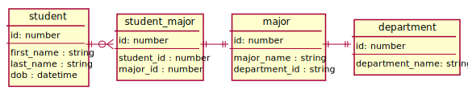

# Student Majors Exercise

Consider the above ERD which includes tables for students, majors, and departments. Complete the following  steps, then answer questions below. Commit all related code and files to the same directory to show your work.

## Prerequisites

_The below steps are prerequisites to others and will vary based on your development environment of choice._

1. Ensure Python >= 3.7 is available within your development environment for use for this exercise.
1. Ensure git is available within your development environment. 

## Preparations

1. Create a git-based repo tracking all commits related to your work with this project.
1. Use `create_db.py` to create `student_major.db` which contains tables and data modeled on the above ERD.
1. Create a file named `answers` which will provide answers to the following questions (for ex., `answers.sql`, `answers.py`, `answers.ipynb`)
1. Add a new unique student record to the student table, notating and showing your work in the file created above.

## Questions

1. What students by first name, last name, and major name sorted alphabetically by last name have majors from the Engineering or Language Arts departments?
1. How many students are there per major and major department?
1. How might you export a single dataset which includes students and their majors to a CSV file (named `question_three.csv`)?
1. How might you import students found in the dataset from `question_three.csv` into `student_major.db` (committing your changes to the database)?

## Turning in Your Work

1. Ensure your work has been committed using git and that your commit history is available.
1. Share a link to your work (using a git-based platform or another shared file storage option) using the email address [mary.griffin@colorado.edu](mailto:mary.griffin@colorado.edu). Do not attach the completed exercise content to an email.
1. Please make sure the link you provide remains available for the duration of your candidacy for this position.

